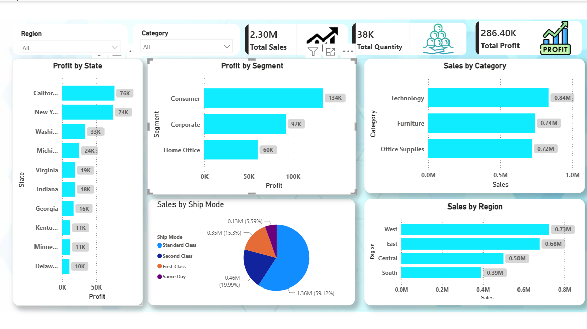

# Retail-Sales-Analysis
Retail Sales Analysis using SQL, Python (Pandas), and Power BI
# 📊 Retail Sales Analysis

## Overview
This project analyzes a retail sales dataset containing 9,994 orders using SQL, Python, and Power BI to uncover business insights and support data-driven decision making.

---

## 🛠️ Tools Used

- SQL (MySQL)
- Python
- Pandas
- NumPy
- Matplotlib
- Power BI
- Microsoft Excel

---

## 📈 Business Questions Answered

- Which product category generated the highest sales?
- Which region generated the highest revenue?
- Which state earned the highest profit?
- Which customer segment is the most profitable?
- How do discounts affect profitability?

---

## 💡 Key Insights

- Technology generated the highest sales (~836K).
- West region achieved the highest total sales.
- California earned the highest profit.
- Consumer segment generated the highest total profit.
- High discounts reduced overall profitability.

---

## 📁 Project Structure

```
Retail-Sales-Analysis
│
├── SQL
├── Python
├── PowerBI
└── Dashboard.png
```

---

## 📊 Dashboard Preview


